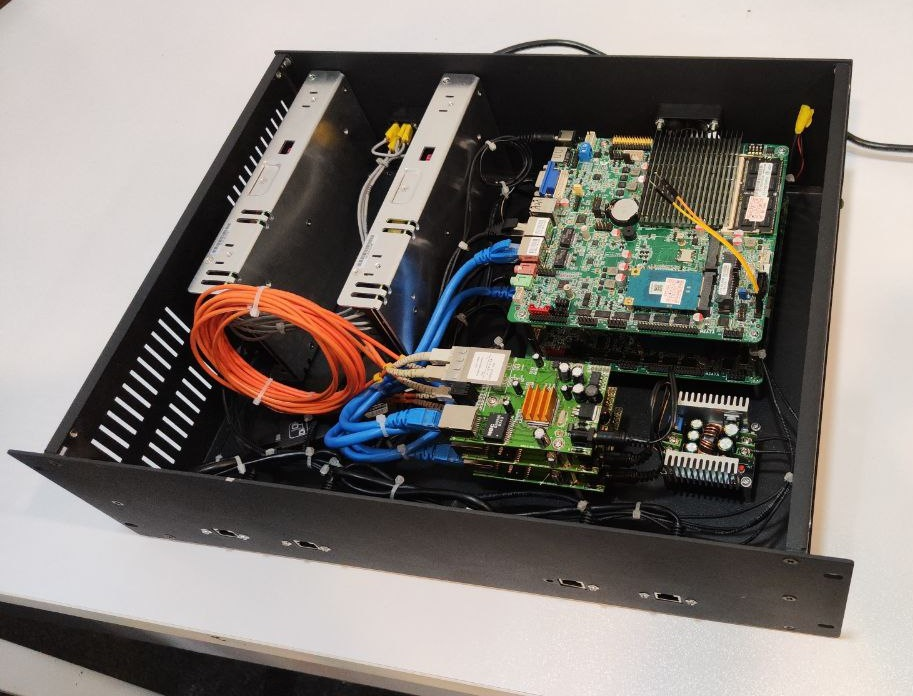

# Secure One-Way Industrial Data Hub

A secure industrial data transfer platform for replicating process data from isolated operational networks to downstream systems through a **physically enforced one-way communication channel**.

<p align="center">
  
</p>

## Architecture

```text
Industrial Network
      │
      ▼
Receiving Board
 ├─ OPC UA Client
 ├─ Modbus Client
 ├─ Siemens S7 Client
 └─ Data Synchronization
      │
      │ UDP
      ▼
Fiber Optic One-Way Boundary
      │
      ▼
Transfer Board
 ├─ UDP Receiver
 ├─ Packet Validation
 └─ Deserialization
      │
      ▼
Replicated Industrial Servers
 ├─ OPC UA Server
 ├─ Modbus Server
 └─ S7 Replication
      │
      ▼
Downstream Clients
```

## Key Features

* **Java 25 LTS** based application
* Modern **Java concurrency** with Virtual Threads
* **Spring Boot** for application infrastructure and configuration
* **Java NIO** and UDP networking
* Binary message serialization and validation
* Protocol-independent industrial data model
* OPC UA, Modbus TCP, and Siemens S7 integration
* Real-time data synchronization and server replication
* Automatic connection recovery and fault isolation
* Structured logging, metrics, and health monitoring
* Physically enforced one-way communication for network isolation

## Technology Stack

**Java 25 · Spring Boot · Gradle · Java NIO · Virtual Threads · Micrometer**

Industrial communication:

**OPC UA · Modbus TCP · Siemens S7**

Core components:

```text
Industrial Protocols
        ↓
Protocol Adapters
        ↓
Java Domain Model
        ↓
Synchronization Engine
        ↓
Binary Serialization
        ↓
UDP Transport
        ↓
Packet Validation
        ↓
Server Replication
```

## Design

The system separates industrial protocol handling, synchronization, transport, serialization, validation, and server replication into independent modules.

Industrial protocol implementations are hidden behind common Java interfaces, allowing the synchronization layer to remain independent of the underlying protocol.

The downstream clients communicate with the replicated OPC UA, Modbus, and S7 servers using standard industrial protocols without needing to know that they are interacting with replicated systems.

## Security

The primary security mechanism is **physical one-way network isolation** using separated RX/TX fiber channels. Software-level protection provides additional defense through:

* Strict packet validation
* Message integrity checks
* Sequence validation
* Size and resource limits
* Fault isolation
* Minimal exposed services

## Build

Requirements:

* **Java 25 LTS**
* Gradle

```bash
./gradlew clean build
```

Run the receiving node:

```bash
./gradlew :apps:receiving-node:bootRun
```

Run the transfer node:

```bash
./gradlew :apps:transfer-node:bootRun
```

## Project Structure

```text
secure-data-hub/
├── apps/
│   ├── receiving-node/
│   └── transfer-node/
│
├── modules/
│   ├── domain/
│   ├── transport/
│   ├── serialization/
│   ├── validation/
│   ├── synchronization/
│   ├── opcua/
│   ├── modbus/
│   ├── s7/
│   └── replication/
│
└── build.gradle.kts
```
